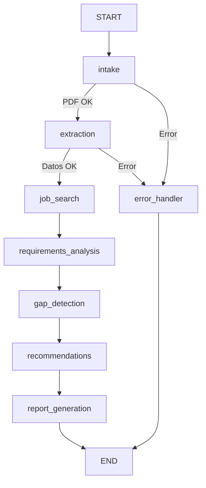

# 🎯 CV Analyzer

**Asistente inteligente para análisis de CV y recomendación de competencias laborales.**

Trabajo Final Integrador — Seminario de Agentes Inteligentes y LLMs.

---

## 📋 Descripción

CV Analyzer es un sistema multi-agente orquestado con **LangGraph** que automatiza el análisis del perfil profesional de un candidato contrastándolo con la demanda real del mercado laboral. El flujo incluye:

1. **Recepción:** Recibe un CV en formato PDF a través de la API REST.
2. **Extracción (LLM):** Extrae información estructurada (habilidades, tecnologías, experiencia, educación).
3. **Búsqueda de Empleo:** Consulta ofertas laborales en tiempo real en múltiples portales seleccionables (Computrabajo, Indeed y LinkedIn).
4. **Análisis de Requisitos:** Analiza qué competencias son más frecuentes en el mercado actual para ese rol.
5. **Detección de Brechas:** Calcula el porcentaje de alineación y detecta habilidades faltantes.
6. **Recomendaciones:** Genera un plan de acción personalizado.
7. **Reporte y Exportación:** Envía estados intermedios al frontend vía Server-Sent Events (SSE) y permite visualizar un reporte premium interactivo con descarga a PDF.

---

## ✨ Características Destacadas

* **Búsqueda Multi-Portal Seleccionable:** El usuario puede elegir y combinar en qué portales de empleo realizar la búsqueda de ofertas (**Computrabajo**, **Indeed** y/o **LinkedIn**) directamente desde los controles del frontend antes de lanzar el análisis.
* **Manejo Inteligente de Anti-Bots (Modo Demo):** Si las solicitudes en tiempo real a portales protegidos (como Indeed o LinkedIn) fallan o son bloqueadas por protecciones de Cloudflare/Captcha, el sistema lo detecta e inyecta ofertas simuladas de referencia asociando el puesto y enlaces dinámicos del portal seleccionado. La interfaz despliega un banner explicativo tipo advertencia alertando sobre este estado.
* **Actualizaciones en Tiempo Real (SSE):** Conectividad cliente-servidor nativa mediante Server-Sent Events para actualizar en vivo la barra de progreso de los agentes paso a paso.
* **Descarga de Reporte PDF:** Generación integrada de informes PDF limpios listos para descargar y compartir.

---

## 🛠️ Tecnologías y Arquitectura

El proyecto está dividido en dos partes principales:

### ⚙️ Backend (Python + FastAPI)
* **Orquestación:** LangGraph (`StateGraph` con estado compartido y condicionales).
* **LLM:** Google Gemini (`gemini-3.5-flash`).
* **PDF Extraction:** PyMuPDF (`fitz`).
* **Web Scraping:** Playwright (ejecutado asíncronamente).
* **Framework Web:** FastAPI (endpoints REST para análisis, reportes y SSE).
* **Exportación PDF:** fpdf2 (con sanitización Unicode).

### 🎨 Frontend (React + Vite)
* **Framework / Bundler:** React 19 + Vite.
* **Estilos:** Tailwind CSS v4 con un diseño moderno de tipo *Glassmorphism* (oscuro y traslúcido).
* **Iconos:** Lucide React.
* **Streaming de Estado:** Consumidor nativo de SSE para mostrar una barra de progreso fluida en tiempo real.

---

## 🚀 Instalación y Uso

### 1. Clonar el repositorio
```bash
git clone https://github.com/tu-usuario/Sistemas-Inteligentes-TP.git
cd Sistemas-Inteligentes-TP
```

### 2. Configurar el Backend

1. Crear y activar el entorno virtual de Python:
   ```bash
   python -m venv venv
   # En Windows:
   venv\Scripts\activate
   # En Linux/Mac:
   # source venv/bin/activate
   ```
2. Instalar dependencias de Python:
   ```bash
   pip install -r requirements.txt
   ```
3. Instalar navegadores para Playwright (Scraping):
   ```bash
   playwright install chromium
   ```
4. Configurar variables de entorno:
   Copia el archivo `.env.example` como `.env`:
   ```bash
   copy .env.example .env
   ```
   Edítalo y agrega tu API Key de Google Gemini:
   ```env
   GOOGLE_API_KEY=tu_api_key_aquí
   ```
   *(Obtené tu API key gratis en: [Google AI Studio](https://aistudio.google.com/))*

5. Iniciar la API de desarrollo de FastAPI:
   ```bash
   uvicorn src.api.main:app --reload
   ```
   La documentación interactiva estará disponible en `http://127.0.0.1:8000/docs`.

### 3. Configurar el Frontend

1. Dirigirte al directorio `frontend`:
   ```bash
   cd frontend
   ```
2. Instalar dependencias de Node.js:
   ```bash
   npm install
   ```
3. Iniciar el servidor de desarrollo de Vite:
   ```bash
   npm run dev
   ```
   El frontend estará accesible en `http://localhost:5173/`.

---

## 📁 Estructura del Proyecto

```
├── requirements.txt            # Dependencias del backend
├── .env.example                # Variables de entorno
├── src/                        # Código del backend
│   ├── api/                    # Endpoints FastAPI y SSE
│   │   └── main.py             # Servidor API
│   ├── config/settings.py      # Configuración centralizada
│   ├── models/                 # Esquemas de validación (Pydantic v2)
│   ├── graph/                  # Orquestación LangGraph
│   │   ├── state.py            # TypedDict de estado global
│   │   ├── builder.py          # Topología del grafo
│   │   └── nodes/              # Nodos individuales del flujo
│   ├── tools/                  # Herramientas (LLM, PDF, Scraping)
│   └── prompts/                # Ingeniería de prompts
└── frontend/                   # Código de React (Vite + Tailwind v4)
    ├── package.json
    ├── tailwind.config.js
    ├── index.html
    └── src/
        ├── main.jsx
        ├── App.jsx             # Orquestación de estados y cliente SSE
        ├── index.css           # Estilos base y tokens Tailwind
        └── components/         # UploadSection, ProgressTracker, Dashboard, etc.
```

---

## 🏗️ Arquitectura del Grafo

El flujo de procesamiento del currículum se compone de la siguiente topología de nodos y aristas:



---

## 📄 Licencia

Proyecto académico desarrollado como Trabajo Final Integrador para el **Seminario de Agentes Inteligentes y LLMs**.
