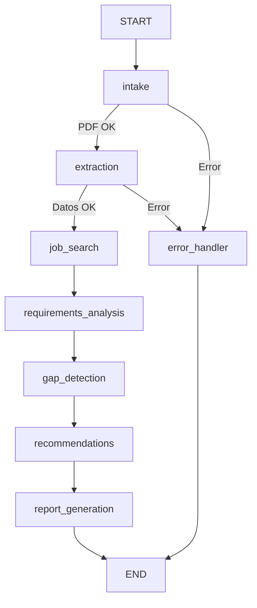

# 🎯 CV Analyzer

**Asistente inteligente para análisis de CV y recomendación de competencias laborales.**

Trabajo Final Integrador — Seminario de Agentes Inteligentes y LLMs.

---

## 📋 Descripción

CV Analyzer es un sistema multi-agente orquestado con **LangGraph** que automatiza el análisis del perfil profesional de un candidato contrastándolo con la demanda real del mercado laboral. El flujo incluye:

1. **Recepción:** Recibe un CV en formato PDF.
2. **Extracción (LLM):** Extrae información estructurada (habilidades, tecnologías, experiencia, educación).
3. **Búsqueda de Empleo:** Consulta ofertas laborales relevantes en tiempo real.
4. **Análisis de Requisitos:** Analiza qué competencias son más frecuentes en el mercado actual para ese rol.
5. **Detección de Brechas:** Calcula el porcentaje de alineación y detecta habilidades faltantes.
6. **Recomendaciones:** Genera un plan de acción personalizado.
7. **Reporte y Exportación:** Muestra un informe final interactivo con opción de descarga en PDF.

## 🛠️ Tecnologías

| Componente | Tecnología |
|:---|:---|
| Orquestación | **LangGraph** |
| LLM | **Google Gemini** (`gemini-3.1-flash-lite`) |
| PDF Extraction | **PyMuPDF** |
| Web Scraping | **Playwright** (Asíncrono) |
| Frontend | **Streamlit** |
| Modelos de Datos | **Pydantic v2** |
| Exportación PDF | **fpdf2** |

## 🚀 Instalación

### 1. Clonar el repositorio

```bash
git clone https://github.com/tu-usuario/Sistemas-Inteligentes-TP.git
cd Sistemas-Inteligentes-TP
```

### 2. Crear entorno virtual

```bash
python -m venv venv
venv\Scripts\activate  # Windows
# source venv/bin/activate  # Linux/Mac
```

### 3. Instalar dependencias

```bash
pip install -r requirements.txt
```

### 4. Instalar navegadores para Playwright (Scraping)

```bash
playwright install chromium
```

### 5. Configurar variables de entorno

Copiar el archivo de ejemplo y configurar la API Key:
```bash
copy .env.example .env
```

Editar `.env` y agregar tu API key de Google Gemini:
```env
GOOGLE_API_KEY=tu_api_key_aquí
```
> Si no tenés una, podés obtenerla gratis en: [Google AI Studio](https://aistudio.google.com/)

### 6. Ejecutar la aplicación

```bash
streamlit run app.py
```

## 📁 Estructura del Proyecto

```
├── app.py                      # Punto de entrada de la UI (Streamlit)
├── requirements.txt
├── .env.example
├── src/
│   ├── config/settings.py      # Configuración centralizada
│   ├── models/                 # Schemas de validación (Pydantic)
│   ├── graph/                  # Orquestación LangGraph
│   │   ├── state.py            # TypedDict de estado global
│   │   ├── builder.py          # Definición de topología y edges
│   │   └── nodes/              # Nodos del flujo (intake, extraction, etc.)
│   ├── tools/                  # Funciones de soporte (PDF, LLM, Scraping)
│   ├── prompts/                # Ingeniería de prompts
│   └── ui/                     # Componentes y estilos de Streamlit
```

## 🏗️ Arquitectura del Grafo

El núcleo del sistema es un grafo de estados dirigido (`StateGraph`) implementado con LangGraph:



Cada nodo actualiza un estado global tipado (`CVAnalysisState`) que fluye a través del pipeline.

## 📄 Licencia

Proyecto académico creado para el Seminario de Agentes Inteligentes y LLMs.
